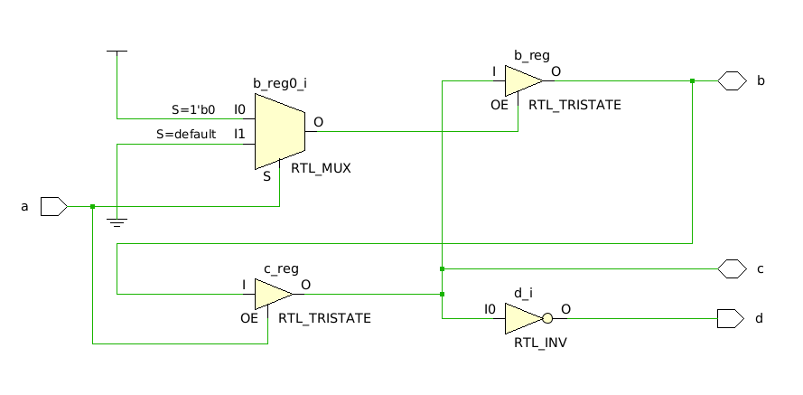
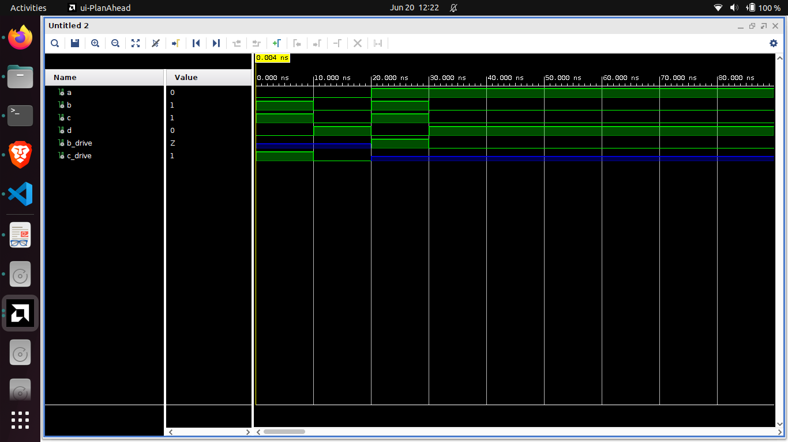

# Exercício 1 – Circuito com Buffer 3-State

Desenvolva um circuito com 4 portas:
- a (entrada lógica): controla a direção dos dados.
- b, c: sinais bidirecionais.
- d: saída lógica.

Funcionamento esperado:
- Se a = '0': o valor de c deve ser passado para b.
- Se a = '1': o valor de b deve ser passado para c.
- A saída d deve ser o inverso do sinal presente em c.
- Use buffers 3-state para controlar a direção dos sinais em b e c.

## Resolução

O código deste repositório gera o seguinte RTL:

MUX + Tristate (b_reg0_i + b_reg)
- É a lógica do controle condicional da linha b:
    - Quando a = '0', c vai para b.
    - Implementado com mux + buffer triestado.

Tristate para c (c_reg)
- Quando a = '1', b vai para c.

Inversor (d_i)
- Recebe c como entrada e envia not c para d.

E esse é a simulação do circuito:

Perceba que parece acontecer o que foi proposto. Quando a = 0, o valor de c é passado para o b. E quando b = 1, o valor de b é passado para c.

Isso é garantido pelos sinais b_drive e c_drive que ficam com impedância alta Z, quando o pino respectivo (b ou c) é bloqueado como entrada.