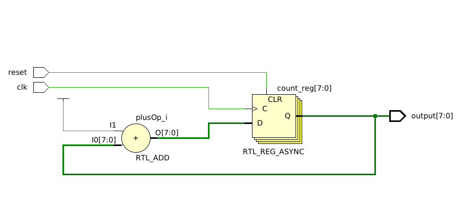

# Exercício 2 – Contador com Diferentes Tipos de Dados

Implemente um contador que incrementa a cada ciclo de clock. O contador deve ser
feito três vezes, utilizando diferentes tipos de dados:
- integer com intervalo de -128 a 127.
- signed(7 downto 0)
- unsigned(7 downto 0)

Requisitos:
- Para cada tipo, crie uma entidade separada.
- O contador deve possuir entrada clk, reset, e uma saída com o valor atual.
- Escreva um testbench para verificar o comportamento com reset e contagem
contínua.

## Resolução

O código de um dos contadores (signed_counter) deste repositório gera o seguinte RTL:

### RTL_ADD (Bloco de soma)

Soma dois operandos:
- I0: a saída atual do registrador (count)
- I1: valor constante 1 (implícito no código count + 1)

Saída: resultado da operação count + 1, enviado para o registrador.

### Registrador com Reset Assíncrono — RTL_REG_ASYNC
É o registrador count, de 8 bits.

Tem as seguintes entradas:
- D: dado de entrada (resultado da soma)
- C: sinal de reset assíncrono
- (clock): controle de borda de subida do clock

Saída Q:
- Fornece o valor atual do contador (count)
- É realimentada para a entrada da soma
- Também vai para a saída output

E esse é a simulação do circuito:

Perceba que quando o reset é desativado, a contagem acontece a cada ciclo de clock, para todos os contadores.