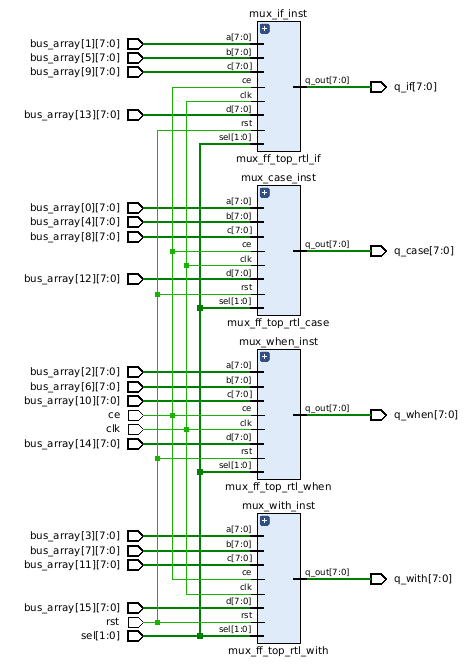
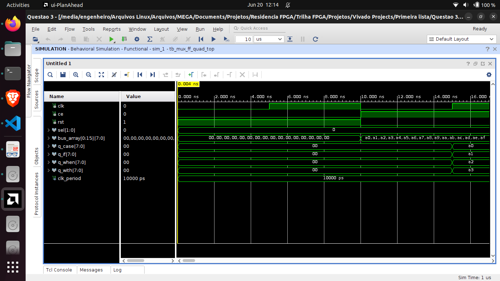

# Exercício 3 – MUX com Diferentes Estruturas de Controle

Implemente um multiplexador 4:1 com 4 entradas de 8 bits e uma seleção de 2 bits. Faça 4 versões:
1. Usando case
2. Usando if-elsif
3. Usando when-else
4. Usando with-select

## Resolução

O código mux_ff_quad_top deste repositório gera o seguinte RTL:

O sistema implementa quatro variações de um multiplexador 4x1 de 8 bits, usando diferentes construções da linguagem VHDL:

- IF-ELSIF
- CASE
- WHEN-ELSE
- WITH-SELECT

Cada um é conectado a um flip-flop de 8 bits com clk, ce (clock enable) e rst.

Cada um deles:

- Recebe 4 sinais de 8 bits do vetor bus_array.
- Escolhe uma das 4 entradas com base em sel (2 bits).
- Registra a saída com flip-flop (registrador de 8 bits).
- Entrega a saída final (q_case, q_if, q_when, q_with).

### RTL_ADD (Bloco de soma)

E esse é a simulação do circuito:

A primeira imagem da simulação mostra a mudança dos valores definidos no bus_array na simulação. Nos próximos ciclos de clock, os seletor sel[1:0] é testado com todos os seus valores possíveis: 00, 01, 10 e 11.

Perceba que no próximo ciclo de clock, cada multiplexador seleciona a sua primeira entrada para a saída, respectivamente sendo as saídas de cada multiplexador: a0, a1, a2 e a3.

a4, a5, a6 e a7 no próximo ciclo, e assim por diante, de acordo com a seleção.
