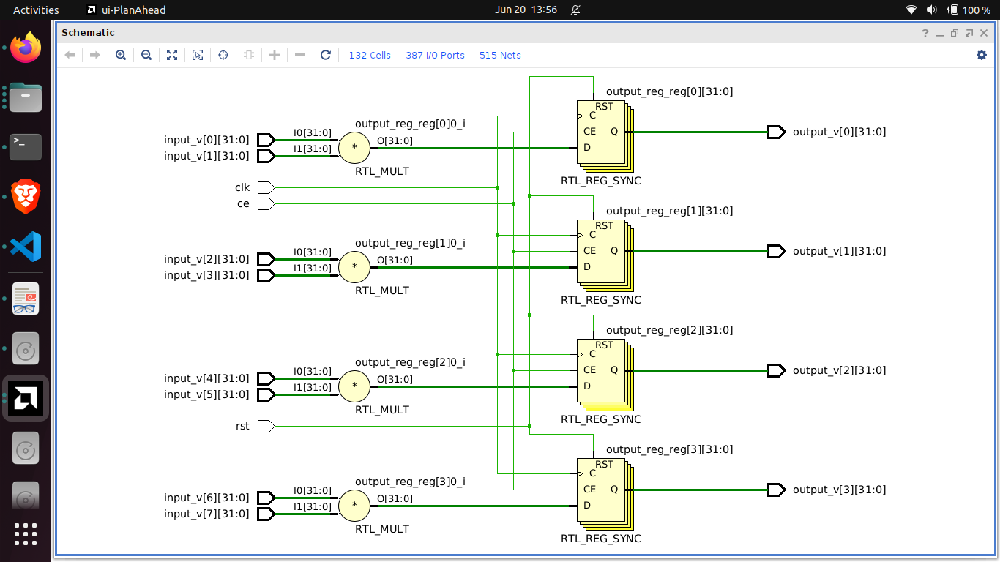
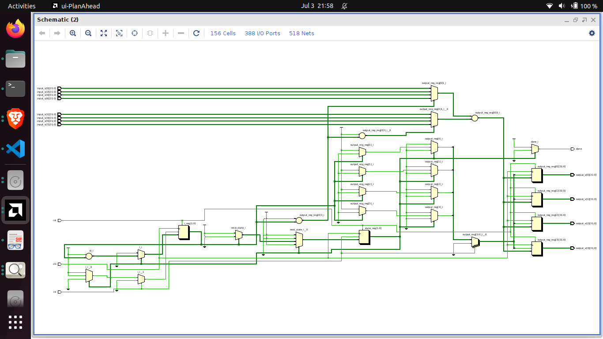
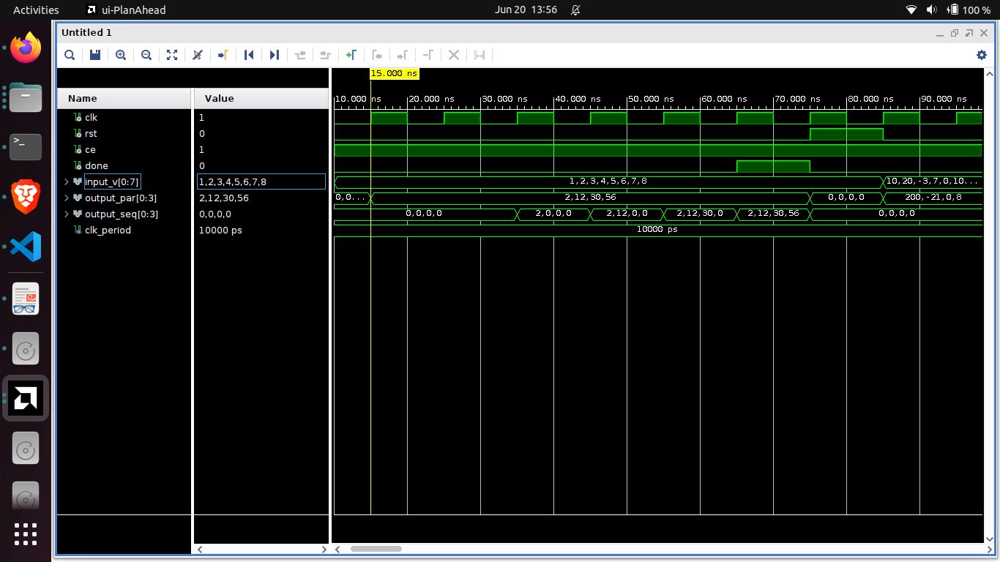

# Exercício 4 – Multiplicações em Paralelo e Sequencial

Implemente um circuito que recebe 8 inteiros como entrada (por exemplo, in(0) to in(7)), e realiza multiplicações aos pares:
- in(0)*in(1), in(2)*in(3), ..., in(6)*in(7)

Faça duas versões:
- Versão A (paralela): usa um loop que instancia todas as multiplicações simultaneamente.
- Versão B (sequencial): usa uma máquina de estados ou contador interno que executa as multiplicações uma por vez, por ciclo de clock.

## Resolução

O código parallel_multiplier_ff deste repositório gera o seguinte RTL:

O código sequential_multiplier_ff também gera um rtl, porém fica com muitos blocos.

### RTL_ADD (Bloco de soma)

E esse é a simulação do circuito:

Observe quando os valores de input são setados. Os valores de input são: 1, 2, 3, 4, 5, 6, 7 e 8.

No paralelo: A partir do próximo ciclo de clock, todas as operações são realizadas.

No sequencial: A partir do próximo ciclo de clock apenas uma operação é realizada, e assim por diante até finalizar a quantidade de operações.
